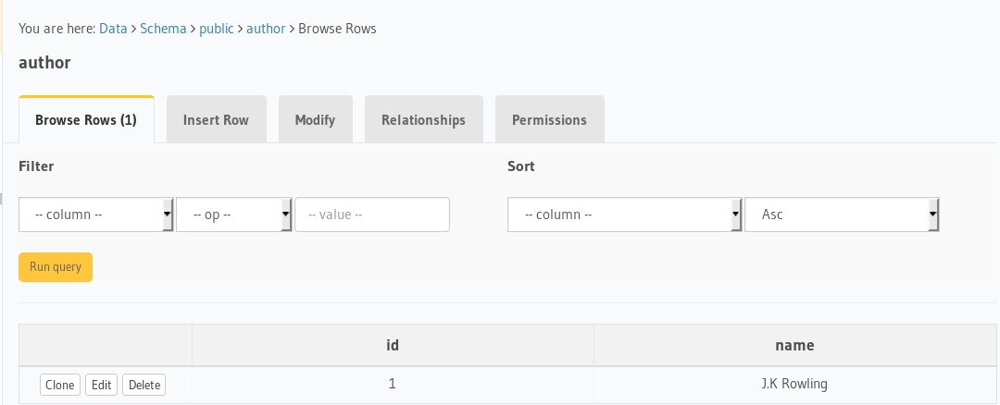

# nextjs-postgres-graphql

Boilerplate to get started with Nextjs, Hasura GraphQL engine as CMS and postgres as database using this awesome library: [withData](https://github.com/adamsoffer/next-apollo).


# Tutorial

- Deploy Postgres and GraphQL Engine on Heroku:
  
  [](https://heroku.com/deploy?template=https://github.com/hasura/graphql-engine-heroku)
- Get the Heroku app URL (say `my-app.herokuapp.com`)
- Clone this repo:
  ```bash
  git clone https://github.com/hasura/graphql-engine
  cd graphql-engine/community/boilerplates/nextjs-postgres-graphql
  ```

- Create `author` table:
  
  Open Hasura console: visit https://my-app.herokuapp.com on a browser  
  Navigate to `Data` section in the top nav bar and create a table as follows:

  

- Insert sample data into `author` table:

  

  Verify if the row is inserted successfully

  

- Install npm modules:
  ```bash
  npm install
  ```

- Configure `nextjs` to use `react-apollo` and `withData` to fetch data in the server and render it on the server.
    - Create config with the following content
      ```js
      import { withData } from 'next-apollo'
      import { HttpLink } from 'apollo-link-http'
      
      // can also be a function that accepts a `context` object (SSR only) and returns a config
      const config = {
        link: new HttpLink({
          uri: 'https://hasura-graphql-2.herokuapp.com/v1alpha1/graphql', // <- Configure GraphQL Server URL (must be absolute)
        })
      }

      export default withData(config)
      ```

- Use `Query` component from `react-apollo` to make a GraphQL requests and wrap it with the `withData` component from `config`
    - Create GraphQL query

      ```js

      const query = gql`
      	query {
      	  author {
      	    id
      	    name
      	  }
      	}
      `

      ```
    - Wrap your component with `Query`
      ```js

        <Query    // <- Wrapping the main component with Query component from react-apollo
          query={ query }
          fetchPolicy={ 'cache-and-network' }
        >
          {({ loading, data: { author:authors }}) => {
            return (
              <div>
                <AuthorList authors={authors} />
              </div>
            );
          }}
        </Query>

      ```


- Run the app:
  ```bash
  npm run dev -- -p 8000
  ```
- Test the app
  Visit [http://localhost:8000](http://localhost:8000) to view the app

  

# How it works

  It uses [next-apollo](https://github.com/adamsoffer/next-apollo#how-does-it-work) underneath which ensures that data required by your component is available before your component is rendered on the server and nextjs takes care of the rest.

# Contributing

Checkout the [contributing guide](../../../CONTRIBUTING.md#community-content) for more details.
